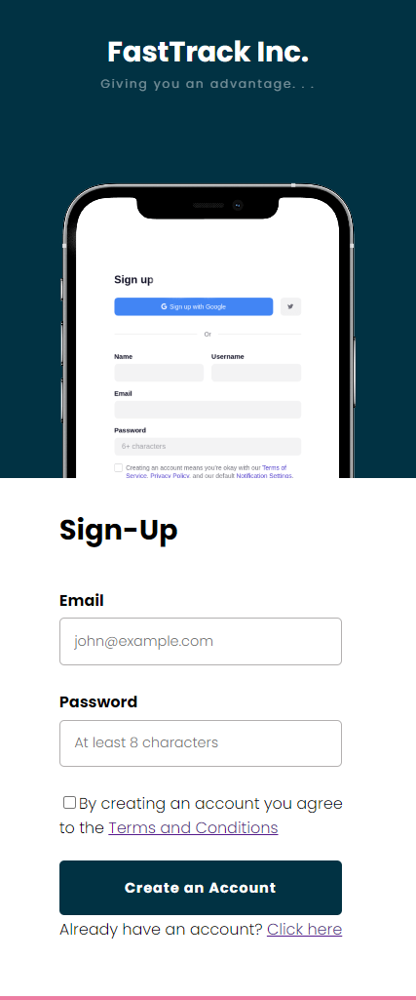

# Sign Up Form w/ Feedback Message

## Description
A Responsive Landing page for Sign up. It receives users information and upon successful submission responds with a personalised feedback message.

Live Demo Here: https://agbesochristian.github.io/Sign-Up-form-1/

## Key Learnings:
1. Background Image
2. Viewport Height
3. Building forms - Form element, labels, input-types
4. Accessing the form inputs with Javascript using FormData() constructor function and the .get() method 
5. Generating a personalised feedback message using the form inputs.
4. setTimeout method.
